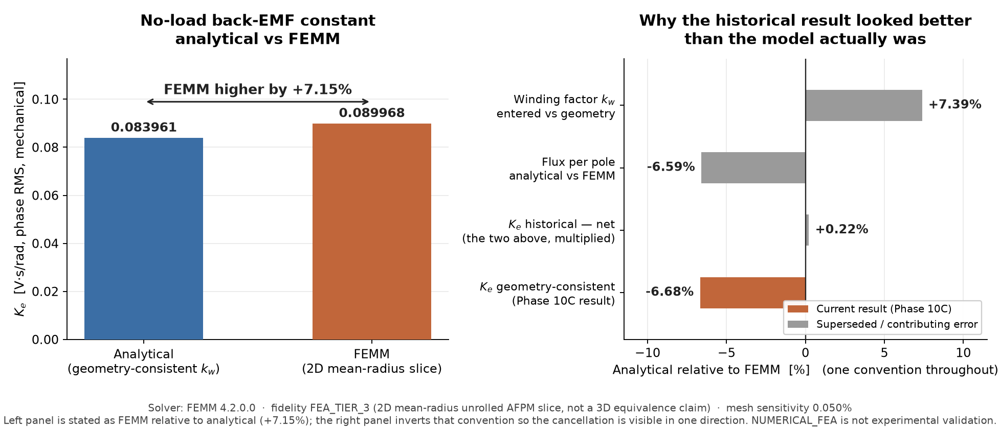
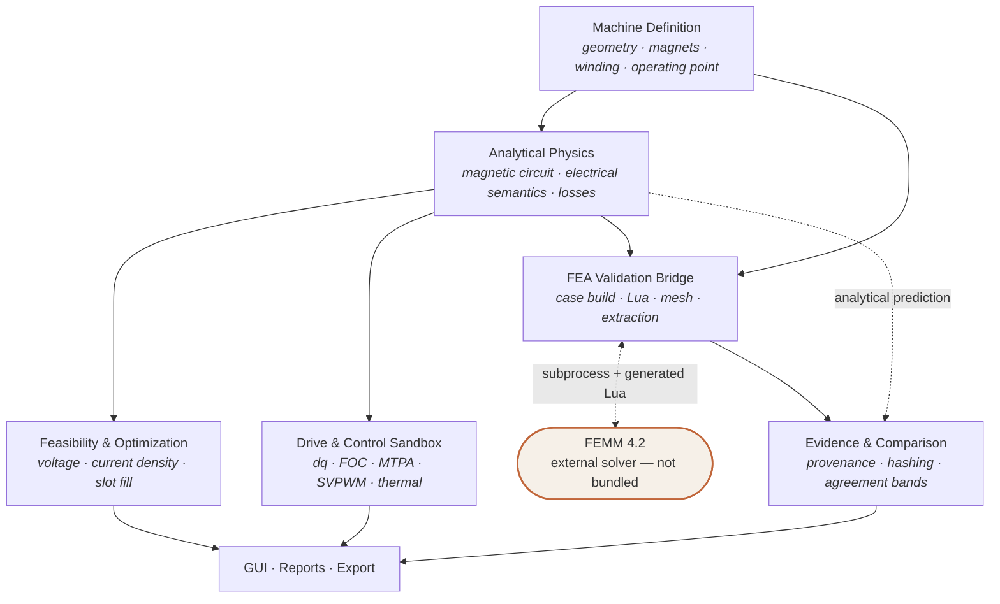

# MotorCalculator
### Electric Machine & Drive Engineering Workbench

Analytical modeling, drive simulation, engineering feasibility, optimization, and
numerical FEA validation for permanent-magnet machines.


---

MotorCalculator is a desktop engineering workbench for **axial-flux permanent-magnet
(AFPM)** machines. It takes a machine definition through analytical electromagnetic
modeling, feasibility and manufacturability checks, design optimization, and a
drive/control simulation sandbox — and then **checks its own analytical predictions
against an independent finite-element solver**.

What separates it from a spreadsheet-style motor calculator is the last part. The
project runs a real [FEMM 4.2](https://www.femm.info/) magnetostatic campaign, extracts
phase flux linkage from the solved field, reconstructs back-EMF, and compares that to
its own analytical result — with deterministic case hashing, solver provenance, mesh
sensitivity, and an explicit refusal to let numerical agreement be mistaken for
experimental proof.

**Current validation maturity:** one geometry-consistent numerical (FEA) comparison of
no-load back-EMF, at `FEA_TIER_3` fidelity, showing a **+7.15 % residual** that is being
tracked to the analytical magnetic circuit. **No physical motor has been tested.** See
[Validation Status](#validation-status).

---

## Contents

- [Capabilities](#capabilities)
- [Validation Status](#validation-status)
- [Known Limitations](#known-limitations)
- [Architecture](#architecture)
- [Repository Structure](#repository-structure)
- [Installation](#installation)
- [FEMM Setup](#femm-setup-optional)
- [Testing](#testing)
- [Engineering Governance](#engineering-governance)
- [Project History](#project-history)
- [References](#references)
- [License](#license)

---

## Capabilities

### Machine Modeling
- AFPM analytical modeling — dual-rotor / single-stator, dual air gap (`双转子、单定子、双气隙`)
- Lumped magnetic circuit: pole flux, air-gap flux density, permeance, reluctance
- PMSM (sinusoidal) and BLDC (trapezoidal) electrical semantics with explicit
  phase/line and RMS/peak bases
- Winding analysis via the slot EMF star — distribution, pitch and skew factors,
  with automatic geometry-derived or manually entered winding factor
- Geometry and manufacturability checks: slot occupancy, current density, wire fit

### Drive & Control *(simulation sandbox)*
- dq-frame PMSM model, amplitude-invariant Park/Clarke transforms
- Field-oriented control foundation with PI current and speed loops
- MTPA and field-weakening reference generation
- Average-value SVPWM modulation model with DC-bus/inverter limits
- Sensor non-idealities, lumped thermal and dynamic loss models

> These live in `motor_calculator/dynamics/` and are exposed through an
> **Engineering Analysis (sandbox)** dialog. They are simulation studies: they do not
> write back into the production calculation chain or project defaults.

### Engineering Analysis
- Voltage feasibility on a single, consistent line-RMS basis
- Current density, slot occupancy and design-rule severity grading
- Copper, conductor eddy-current, aggregate magnetic and mechanical loss estimates
- Efficiency and speed-sweep dashboards with explicit scope statements
- Monte-Carlo uncertainty, sensitivity sweeps and a confidence/evidence summary
- Automated design optimization over turns and parallel paths

### Numerical Validation
- Automated **FEMM 4.2** bridge: geometry, materials, winding and mesh generation,
  subprocess execution, result extraction
- Deterministic dual hashing — a solver-visible `case_id` and a separate analytical
  fingerprint, so an analytical edit invalidates the *comparison* without discarding a
  still-valid *field solution*
- Full solver provenance: executable path, version, script hash, mesh policy, element
  count, timestamps
- Mesh sensitivity study gated by the project's own convergence criteria
- Analytical-vs-FEA comparison with descriptive (never pass/fail) agreement bands
- **No automatic calibration.** FEA results never modify an analytical parameter

---

## Validation Status

| Item | Status |
|---|---|
| Regression suite | **1036 passed, 3 skipped** |
| Real FEMM integration | **PASS** (FEMM 4.2.0.0, 2019-04-21 build) |
| Numerical validation target | No-load back-EMF / `Ke` |
| Geometry-consistent residual | **+7.15 %** (FEMM higher than analytical) |
| FEA model | 2D mean-radius unrolled AFPM slice |
| FEA fidelity tier | `FEA_TIER_3` |
| Mesh sensitivity | 0.050 % |
| Physical experimental validation | **NOT YET PERFORMED** |



> ### `NUMERICAL_FEA` is not `EXPERIMENTAL_MEASUREMENT`
>
> A finite-element solver is an independent *numerical* reference, not a physical one.
> Agreement with FEMM does not establish that either model matches a real machine.
> No motor has been built or bench-tested against these predictions.

### The result that makes this worth reading

An earlier comparison appeared to agree to **−0.22 %** — an excellent-looking number.
It was not.

Back-EMF is proportional to `N · k_w · Φ`, so a `Ke` comparison can only ever test that
*product*. The analytical model was carrying a hand-entered winding factor of `0.93`
while the winding actually meshed by the solver has a geometric `k_w` of `0.8660`. Two
errors were cancelling:

| Component | Analytical relative to FEMM |
|---|---:|
| Winding factor `k_w` | **+7.39 %** |
| Flux per pole | **−6.59 %** |
| **Net (their product)** | **+0.22 %** |

Removing the winding-factor inconsistency — and reusing the *same* field solution,
proven reusable because all 52 emitted solver scripts were byte-identical — moved the
residual to **+7.15 %**, which sits alongside a **+7.06 %** flux residual. Mesh
sensitivity is 0.050 %, roughly 140× smaller, so the residual is **model form, not
discretization**.

That residual is currently attributed, with supporting evidence, to the analytical
model using a lumped DC pole flux in a formula that expects the *fundamental* flux per
pole. It has **not** been corrected: measurement and correction are kept as separate
phases, and no parameter was tuned to improve agreement.

Full write-up: [`docs/phase10c_self_consistent_ke_validation_zh.md`](docs/phase10c_self_consistent_ke_validation_zh.md)
· Raw evidence: [`validation_data/fea_results/`](validation_data/fea_results/)

---

## Known Limitations

Read this section before drawing engineering conclusions.

- **`FEA_TIER_3` is not 3D equivalence.** The FEA model is a single mean-radius
  unrolled 2D slice. It cannot represent radial pole-pitch variation, inner/outer edge
  fringing, end-winding geometry, or 3D leakage.
- **The `Ke` evidence is one design at one operating point.** It is not a validated
  accuracy claim across the design space.
- **No experimental motor-bench validation has been performed.**
- **Conductor eddy-current loss is `EXPERIMENTAL`** — a single scalar air-gap field
  applied to the whole copper volume, including end windings.
- **Aggregate magnetic loss is `EMPIRICAL_LUMPED`** — a fixed fraction of rated output,
  decoupled from speed and flux density.
- **Thermal modeling is simplified.** Static temperature rise is not predicted rather
  than being predicted badly.
- **The speed sweep is not a torque-speed capability envelope.** It is a point-by-point
  recomputation; the loss model is speed-decoupled and must not be extrapolated.
- **BLDC same-basis voltage margin is unsupported** (`NOT_ENOUGH_SEMANTICS`) — BLDC has
  no sinusoidal phasor basis, and no equivalent is fabricated.
- **Torque and cogging have not been FEA-validated** (`NOT_YET_VALIDATED`). The coreless
  reference has no cogging by construction.
- **No manufacturing certification, no standards-compliance claim.**
- **No automatic model calibration** — by design.

---

## Architecture



FEMM is an **external dependency the user installs separately**. It is detected at
runtime, never bundled and never redistributed. The application starts and runs
normally without it; only the validation features become unavailable.

---

## Repository Structure

| Path | Purpose |
|---|---|
| `motor_calculator/motor_core/` | Analytical kernel — magnetic circuit, electrical semantics, winding factor, losses. **Change-controlled.** |
| `motor_calculator/dynamics/` | Drive/control simulation sandbox — dq model, FOC, MTPA, SVPWM, thermal |
| `motor_calculator/validation/` | Feasibility, uncertainty, confidence, external-reference import |
| `motor_calculator/fea/` | FEMM bridge — case building, geometry/material/winding mapping, solver adapter, comparison, evidence |
| `motor_calculator/gui/` | Tkinter GUI, dashboards, dialogs |
| `motor_calculator/plots/` | Dashboard data, charts, CSV/figure export |
| `motor_calculator/project/` | `.motorproj` save/load, autosave, crash recovery |
| `motor_calculator/tests/` | 107 test modules |
| `validation_data/` | Reference cases, reconstructed literature data, FEA evidence bundles |
| `docs/` | Engineering documentation and phase reports (largely Chinese) |
| `installer/`, `packaging/`, `work/` | Inno Setup script, PyInstaller spec, build/utility scripts |

---

## Installation

### From source

Requires **Python 3.12** on Windows with a working Tcl/Tk (the official python.org
installer is recommended — some redistributions ship a broken `init.tcl`).

```powershell
py -3.12 -m venv .venv
.venv\Scripts\python.exe -m pip install -r requirements.txt
.venv\Scripts\python.exe -m pip install -r requirements-dev.txt
```

Charts are optional — the application imports, calculates and exports JSON/CSV/TXT
without `matplotlib`; only in-GUI plotting and image export need it:

```powershell
.venv\Scripts\python.exe -m pip install -r requirements-gui.txt
```

Launch:

```powershell
.venv\Scripts\python.exe motor_calculator\app.py
```

Verify Tcl/Tk independently if the GUI fails to start:

```powershell
.venv\Scripts\python.exe work\check_tk_runtime.py
```

Mutable runtime data is stored **outside the repository**, under
`%LOCALAPPDATA%\MotorCalculator\`. Set `MOTOR_CALCULATOR_USER_DATA` only when a
controlled portable or test location is required.

### Windows packaged build

A one-folder PyInstaller build and an Inno Setup installer are produced by:

```powershell
.venv\Scripts\python.exe -m pip install -r requirements-packaging.txt
powershell -ExecutionPolicy Bypass -File work\build_windows_release.ps1
```

Build output (`build/`, `dist/`, `release/`) is intentionally **not committed**.
Installer and portable ZIP artifacts will be published as **GitHub Release assets** —
see [Release Strategy](docs/publication/release_strategy.md). They are not yet uploaded.

---

## FEMM Setup *(optional)*

FEA validation requires [FEMM](https://www.femm.info/) installed separately.

- **Tested with:** FEMM **4.2.0.0**, 2019-04-21 build, on Windows
- **Not bundled, not redistributed.** MotorCalculator only detects an existing install.
- Detection covers `PATH`, conventional install directories, the Windows registry
  (App Paths and uninstall entries), the `.fem` file association, per-user
  `Programs` directories and every fixed drive. Override with `MOTORCALC_FEMM_EXE`.
- **Without FEMM the application runs normally.** The validation dialog reports
  `未检测到 FEMM。当前可生成验证案例，但无法执行求解。` and still generates and exports
  solver scripts, which can be carried to a machine that has FEMM.
- Real-solver tests are marked `femm_integration` and **skip** when FEMM is absent, so
  an optional external solver never fails the normal regression.

---

## Testing

```powershell
.venv\Scripts\python.exe -m pytest -q
```

Current: **1036 passed, 3 skipped** across 107 test modules. The 3 skips are
solver-availability branches that do not apply when FEMM is installed.

Major categories:

| Area | Covers |
|---|---|
| Electrical semantics | phase/line, RMS/peak, Ke/Kt, PMSM vs BLDC bases |
| Magnetic & winding | magnetic circuit, slot EMF star, winding factor |
| Feasibility & optimizer | voltage margin, current density, slot fill, design search |
| Project persistence | `.motorproj` save/load, schema, autosave, crash recovery |
| GUI & packaging smoke | real Tk startup, dashboards, one-folder build, installer |
| FEMM integration | marked `femm_integration`; real solver bring-up and solve |
| Validation provenance | case hashing, staleness, evidence classification, no auto-calibration |
| Localization | Chinese-first UI, stable string keys |

Run only the real-solver tests:

```powershell
.venv\Scripts\python.exe -m pytest -m femm_integration -v
```

---

## Engineering Governance

- **Protected analytical kernel.** `motor_core/calculations.py` and the frozen
  regression baseline are SHA-256 pinned; changes require explicit approval and are
  recorded in an approved-change log.
- **Versioned model changes** with documented old/new semantics and expected numerical
  impact, so a result that moves is never a surprise.
- **Legacy compatibility.** Superseded quantities are retained under explicit `legacy_`
  names rather than being silently reinterpreted.
- **Evidence classification.** `INTERNAL_ANALYTICAL`, `NUMERICAL_FEA`,
  `INDEPENDENT_FEA_REFERENCE`, `EXPERIMENTAL_MEASUREMENT` are distinct and never
  conflated.
- **No automatic calibration.** `AUTO_CALIBRATION_ENABLED` is a constant `False` with no
  code path that flips it; a regression test scans the FEA package for curve-fitting.

---

## Project History

Single-file prototype → modular, testable core → corrected electrical semantics
(phase/line, RMS/peak, Ke/Kt) → drive and control modeling → Windows productization
(installer, project files, crash recovery) → corrected PMSM voltage semantics →
FEMM numerical validation bridge → real-solver Ke validation.

Detailed engineering history, including formula-change approvals and validation
campaigns, is in [`docs/`](docs/) (largely Chinese).

This repository evolved from an earlier permanent-magnet motor calculation prototype;
the original implementation is retained in the `legacy/original-main` branch and is not
merged into this history.

---

## References

External sources used for reconstructed validation cases:

- A. Parviainen, *Design of Axial-Flux Permanent-Magnet Low-Speed Machines and
  Performance Comparison Between Radial-Flux and Axial-Flux Machines*, doctoral
  dissertation, Lappeenranta University of Technology, 2005.
  `URN:ISBN:952-214-030-9` — [lutpub.lut.fi](https://lutpub.lut.fi/handle/10024/31185)
- Abdelli et al., *Design and Manufacturing of Axial Flux Permanent Magnet Machine*,
  Science and Technology for Energy Transition, 2026.
  [doi:10.2516/stet/2026004](https://doi.org/10.2516/stet/2026004)
- Hosseini et al., *Design, Prototyping and Analysis of a Low-Cost Disk Permanent
  Magnet Generator*, 2008.
- Price et al., *Design and Testing of a Permanent Magnet Axial Flux Wind Power
  Generator*, IJME, 2009.

Extraction records and field-by-field mappings are under
[`docs/validation_sources/`](docs/validation_sources/) and
[`validation_data/reconstructed_cases/`](validation_data/reconstructed_cases/).

These are **reconstructed reference cases** used for comparison. They do not constitute
experimental validation of this software, and no standards compliance is claimed.

---

## License

Licensed under the **Apache License, Version 2.0** — see [`LICENSE`](LICENSE).

Attribution for third-party components, and the fact that FEMM is detected rather than
bundled or redistributed, is recorded in [`NOTICE`](NOTICE).

The reasoning behind this choice is kept in
[`docs/publication/license_options.md`](docs/publication/license_options.md).
